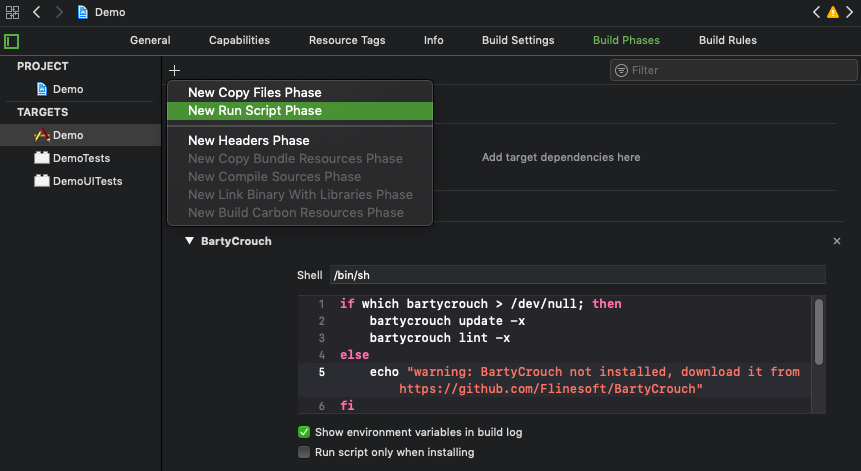
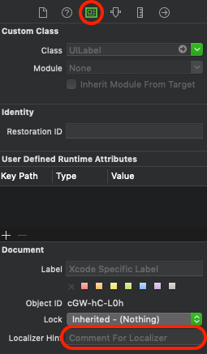
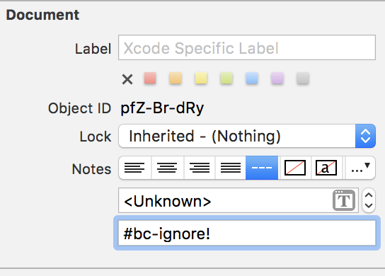

<p align="center">
    
</p>

<p align="center">
  <a href="https://github.com/FlineDev/BartyCrouch/actions?query=workflow%3ACI+branch%3Amain">
    
  </a>
  <a href="https://www.codacy.com/gh/FlineDev/BartyCrouch">
    
  </a>
  <a href="https://www.codacy.com/gh/FlineDev/BartyCrouch">
    
  </a>
  <a href="https://github.com/FlineDev/BartyCrouch/releases">
    
  </a>
  
  <a href="https://github.com/FlineDev/BartyCrouch/blob/main/LICENSE.md">
    
  </a>
  <br />
  <a href="https://paypal.me/Dschee/5EUR">
    
  </a>
  <a href="https://github.com/sponsors/Jeehut">
    
  </a>
  <a href="https://patreon.com/Jeehut">
    
  </a>
</p>

<p align="center">
    <a href="#installation">Installation</a>
  • <a href="#configuration">Configuration</a>
  • <a href="#usage">Usage</a>
  • <a href="#build-script">Build Script</a>
  • <a href="#donation">Donation</a>
  • <a href="#migration-guides">Migration Guides</a>
  • <a href="https://github.com/FlineDev/BartyCrouch/issues">Issues</a>
  • <a href="#contributing">Contributing</a>
  • <a href="#license">License</a>
</p>

# BartyCrouch

BartyCrouch **incrementally updates** your Strings files from your Code *and* from Interface Builder files. "Incrementally" means that BartyCrouch will by default **keep** both your already **translated values** and even your altered comments. Additionally you can also use BartyCrouch for **machine translating** from one language to 60+ other languages. Using BartyCrouch is as easy as **running a few simple commands** from the command line what can even be **automated using a [build script](#build-script)** within your project.

Checkout [this blog post](https://jeehut.medium.com/localization-in-swift-like-a-pro-48164203afe2?sk=da26d918390db21261b7ead4837286fc) to learn how you can effectively use BartyCrouch in your projects.

## Requirements

- Xcode 13.3+ & Swift 5.6+
- Xcode Command Line Tools (see [here](http://stackoverflow.com/a/9329325/3451975) for installation instructions)

## Getting Started

### Installation

<details>
<summary>Via <a href="https://brew.sh/">Homebrew</a></summary>

To install Bartycrouch the first time, simply run the command:

```bash
brew install bartycrouch
```

To **update** to the newest version of BartyCrouch when you have an old version already installed run:

```bash
brew upgrade bartycrouch
```
</details>

<details>
<summary>Via <a href="https://github.com/yonaskolb/Mint">Mint</a></summary>

To **install** or update to the latest version of BartyCrouch simply run this command:

```bash
mint install FlineDev/BartyCrouch
```
</details>

### Configuration

To configure BartyCrouch for your project, first create a configuration file within your projects root directory. BartyCrouch can do this for you:

```
bartycrouch init
```

Now you should have a file named `.bartycrouch.toml` with the following contents:

```toml
[update]
tasks = ["interfaces", "code", "transform", "normalize"]

[update.interfaces]
paths = ["."]
subpathsToIgnore = [".git", "carthage", "pods", "build", ".build", "docs"]
defaultToBase = false
ignoreEmptyStrings = false
unstripped = false
ignoreKeys = ["#bartycrouch-ignore!", "#bc-ignore!", "#i!"]

[update.code]
codePaths = ["."]
subpathsToIgnore = [".git", "carthage", "pods", "build", ".build", "docs"]
localizablePaths = ["."]
defaultToKeys = false
additive = true
unstripped = false
ignoreKeys = ["#bartycrouch-ignore!", "#bc-ignore!", "#i!"]

[update.transform]
codePaths = ["."]
subpathsToIgnore = [".git", "carthage", "pods", "build", ".build", "docs"]
localizablePaths = ["."]
transformer = "foundation"
supportedLanguageEnumPath = "."
typeName = "BartyCrouch"
translateMethodName = "translate"

[update.normalize]
paths = ["."]
subpathsToIgnore = [".git", "carthage", "pods", "build", ".build", "docs"]
sourceLocale = "en"
harmonizeWithSource = true
sortByKeys = true

[lint]
paths = ["."]
subpathsToIgnore = [".git", "carthage", "pods", "build", ".build", "docs"]
duplicateKeys = true
emptyValues = true
```

This is the default configuration of BartyCrouch and should work for most projects as is. In order to use BartyCrouch to its extent, it is recommended though to consider making the following changes:

1. To speed it up significantly, provide more specific paths for any key containing `path` if possible (especially in the `update.transform` section, e.g. `["App/Sources"]` for `codePaths` or `["App/Supporting Files"]` for `supportedLanguageEnumPaths`).
2. Remove the `code` task if your project is Swift-only and you use the new [`transform` update task](#localization-workflow-via-transform).
3. If you are using [SwiftGen](https://github.com/SwiftGen/SwiftGen#strings) with the `structured-swift4` template, you will probably want to use the `transform` task and change its `transformer` option to `swiftgenStructured`.
4. If you decided to use the `transform` task, create a new file in your project (e.g. under `SupportingFiles`) named `BartyCrouch.swift` and copy the following code:

```swift
//  This file is required in order for the `transform` task of the translation helper tool BartyCrouch to work.
//  See here for more details: https://github.com/FlineDev/BartyCrouch

import Foundation

enum BartyCrouch {
    enum SupportedLanguage: String {
        // TODO: remove unsupported languages from the following cases list & add any missing languages
        case arabic = "ar"
        case chineseSimplified = "zh-Hans"
        case chineseTraditional = "zh-Hant"
        case english = "en"
        case french = "fr"
        case german = "de"
        case hindi = "hi"
        case italian = "it"
        case japanese = "ja"
        case korean = "ko"
        case malay = "ms"
        case portuguese = "pt-BR"
        case russian = "ru"
        case spanish = "es"
        case turkish = "tr"
    }

    static func translate(key: String, translations: [SupportedLanguage: String], comment: String? = nil) -> String {
        let typeName = String(describing: BartyCrouch.self)
        let methodName = #function

        print(
            "Warning: [BartyCrouch]",
            "Untransformed \(typeName).\(methodName) method call found with key '\(key)' and base translations '\(translations)'.",
            "Please ensure that BartyCrouch is installed and configured correctly."
        )

        // fall back in case something goes wrong with BartyCrouch transformation
        return "BC: TRANSFORMATION FAILED!"
    }
}
```

5. If you don't develop in English as the first localized language, you should update the `sourceLocale` of the `normalize` task.
6. If you want to use the machine translation feature of BartyCrouch, add `translate` to the tasks list at the top and copy the following section into the configuration file with `secret` replaced by your [Microsoft Translator Text API Subscription Key](https://docs.microsoft.com/en-us/azure/cognitive-services/translator/translator-text-how-to-signup#authentication-key):

```toml
[update.translate]
paths = "."
translator = "microsoftTranslator"
secret = "<#Subscription Key#>"
sourceLocale = "en"
```

## Usage

Before using BartyCrouch please **make sure you have committed your code**. Also, we highly recommend using the **build script method** described [below](#build-script).

---

`bartycrouch` accepts one of the following sub commands:

- **`update`:** Updates your `.strings` file contents according to your configuration.
- **`lint`:** Checks your `.strings` file contents for empty values & duplicate keys.

Also the following command line options can be provided:

- **`-v`, `--verbose`**: Prints more detailed information about the executed command.
- **`-x`, `--xcode-output`**: Prints warnings & errors in Xcode compatible format.
- **`-w`, `--fail-on-warnings`**: Returns a failed status code if any warning is encountered.
- **`-p`, `--path`**: Specifies a different path than current to run BartyCrouch from there.

### `update` subcommand

The update subcommand can be run with one or multiple of the following tasks:

- `interfaces`: Updates `.strings` files of Storyboards & XIBs.
- `code`: Updates `Localizable.strings` file from `NSLocalizedString` entries in code.
- `transform`: A mode where BartyCrouch replaces a specific method call to provide translations in multiple languages in a single line. Only supports Swift files.
- `translate`: Updates missing translations in other languages than the source language.
- `normalize`: Sorts & cleans up `.strings` files.

In order to configure which tasks are executed, edit this section in the config file:

```toml
[update]
tasks = ["interfaces", "code", "transform", "normalize"]
```

<details><summary>Options for <code>interfaces</code></summary>

- `paths`: The directory / directories to search for Storyboards & XIB files.
- `subpathsToIgnore`: The subpaths to be ignored inside the directories found via the `paths` option.
- `defaultToBase`: Add Base translation as value to new keys.
- `ignoreEmptyStrings`: Doesn't add views with empty values.
- `unstripped`: Keeps whitespaces at beginning & end of Strings files.
- `ignoreKeys`: Keys (e.g. in the comment) indicating that specific translation entries should be ignored when generating String files. Useful to ignore strings that are gonna be translated in code.

</details>

<details><summary>Options for <code>code</code></summary>

- `codePaths`: The directory / directories to search for Swift code files.
- `subpathsToIgnore`: The subpaths to be ignored inside the directories found via the `paths` option.
- `localizablePaths`: The enclosing path(s) containing the localized `Localizable.strings` files.
- `defaultToKeys`: Add new keys both as key and value.
- `additive`: Prevents cleaning up keys not found in code.
- `customFunction`: Use alternative name to `NSLocalizedString`.
- `customLocalizableName`: Use alternative name for `Localizable.strings`.
- `unstripped`: Keeps whitespaces at beginning & end of Strings files.
- `plistArguments`: Use a plist file to store all the code files for the ExtractLocStrings tool. (Recommended for large projects.)
- `ignoreKeys`: Keys (e.g. in the comment) indicating that specific translation entries should be ignored when generating String files.

</details>

<details><summary>Options for <code>transform</code></summary>

- `codePaths`: The directory / directories to search for Swift code files.
- `subpathsToIgnore`: The subpaths to be ignored inside the directories found via the `paths` option.
- `localizablePaths`:  The enclosing path(s) containing the localized `Localizable.strings` files.
- `transformer`: Specifies the replacement code. Use `foundation` for `NSLocalizedString` or `swiftgenStructured` for `L10n` entries.
- `supportedLanguageEnumPath`: The enclosing path containing the `SupportedLanguage` enum.
- `typeName`: The name of the type enclosing the `SupportedLanguage` enum and translate method.
- `translateMethodName`: The name of the translate method to be replaced.
- `customLocalizableName`: Use alternative name for `Localizable.strings`.
- `separateWithEmptyLine`: Set to `false` if you don't want to have empty lines between Strings entries. Defaults to `true.

</details>

<details><summary>Options for <code>translate</code></summary>

- `paths`: The directory / directories to search for Strings files.
- `subpathsToIgnore`: The subpaths to be ignored inside the directories found via the `paths` option.
- `translator`: Specifies the translation API. Use `microsoftTranslator` or `deepL`.
- `secret`: Your [Microsoft Translator Text API Subscription Key](https://docs.microsoft.com/en-us/azure/cognitive-services/translator/translator-text-how-to-signup#authentication-key) or [Authentication Key for DeepL API](https://www.deepl.com/pro-account/plan).
- `sourceLocale`: The source language to translate from.
- `separateWithEmptyLine`: Set to `false` if you don't want to have empty lines between Strings entries. Defaults to `true.

</details>

<details><summary>Options for <code>normalize</code></summary>

- `paths`: The directory / directories to search for Strings files.
- `subpathsToIgnore`: The subpaths to be ignored inside the directories found via the `paths` option.
- `sourceLocale`: The source language to harmonize keys of other languages with.
- `harmonizeWithSource`: Synchronizes keys with source language.
- `sortByKeys`: Alphabetically sorts translations by their keys.
- `separateWithEmptyLine`: Set to `false` if you don't want to have empty lines between Strings entries. Defaults to `true.

</details>

### `lint` subcommand

The lint subcommand was designed to analyze a project for typical translation issues. The current checks include:

- `duplicateKeys`: Finds duplicate keys within the same file.
- `emptyValues`: Finds empty values for any language.

Note that the `lint` command can be used both on CI and within Xcode via the build script method:

- In Xcode the `-x` or `--xcode-output` command line argument should be used to get warnings which point you directly to the found issue.
- When running on the CI you should specify the `-w` or `--fail-on-warnings` argument to make sure BartyCrouch fails if any warnings are encountered.


### Localization Workflow via `transform`

When the `transform` update task is configured (see recommended step 4 in the [Configuration](#configuration) section above) and you are using the [build script method](#build-script), you can use the following simplified process for writing localized code during development:

1. Instead of `NSLocalizedString` calls you can use `BartyCrouch.translate` and specify a key, translations (if any) and optionally a comment. For example:

```swift
self.title = BartyCrouch.translate(key: "onboarding.first-page.header-title",  translations: [.english: "Welcome!"])
```

2. Once you build your app, BartyCrouch will automatically add the new translation key to all your `Localizable.strings` files and add the provided translations as values for the provided languages.
3. Additionally, during the same build BartyCrouch will automatically replace the above call to `BartyCrouch.translate` with the proper translation call, depending on your `transformer` option setting.

The resulting code depends on your `transformer` option setting:

When set to `foundation`, the above code will transform to:

```swift
self.title = NSLocalizedString("onboarding.first-page.header-title", comment: "")
```

When set to `swiftgenStructured` it will transform to:

```swift
self.title = L10n.Onboarding.FirstPage.headerTitle
```

**Advantages of `transform` over the `code` task:**
* You can provide translations for keys without switching to the Strings files.
* In case you use SwiftGen, you don't need to replace calls to `NSLocalizedString` with `L10n` calls manually after running BartyCrouch.
* Can be combined with the machine translation feature to provide a source language translation in code and let BartyCrouch translate it to all supported languages in a single line & without ever leaving the code.

**Disadvantages of `transform` over the `code` task:**
* Only works for Swift Code. No support for Objective-C. (You can use both methods simultaneously though.)
* Xcode will mark the freshly transformed code as errors (but build will succeed anyways) until next build.
* Not as fast as `code` since [SwiftSyntax](https://github.com/apple/swift-syntax) currently isn't [particularly fast](https://www.jpsim.com/evaluating-swiftsyntax-for-use-in-swiftlint/). (But this should improve over time!)

NOTE: As of version 4.x of BartyCrouch *formatted* localized Strings are not supported by this automatic feature.

### Build Script

In order to truly profit from BartyCrouch's ability to update & lint your `.strings` files you can make it a natural part of your development workflow within Xcode. In order to do this select your target, choose the `Build Phases` tab and click the + button on the top left corner of that pane. Select `New Run Script Phase` and copy the following into the text box below the `Shell: /bin/sh` of your new run script phase:

```shell
export PATH="$PATH:/opt/homebrew/bin"

if which bartycrouch > /dev/null; then
    bartycrouch update -x
    bartycrouch lint -x
else
    echo "warning: BartyCrouch not installed, download it from https://github.com/FlineDev/BartyCrouch"
fi
```



Next, make sure the BartyCrouch script runs before the steps `Compiling Sources` (and `SwiftGen` if used) by moving it per drag & drop, for example right after `Target Dependencies`.

Now BartyCrouch will be run on each build and you won't need to call it manually ever (again). Additionally, all your co-workers who don't have BartyCrouch installed will see a warning with a hint on how to install it.

*Note: Please make sure you commit your code using source control regularly when using the build script method.*

---

### Exclude specific Views / NSLocalizedStrings from Localization

Sometimes you may want to **ignore some specific views** containing localizable texts e.g. because **their values are going to be set programmatically**.

For these cases you can simply include `#bartycrouch-ignore!` or the shorthand `#bc-ignore!` into your value within your base localized Storyboard/XIB file. Alternatively you can add `#bc-ignore!` into the field "Comment For Localizer" box in the utilities pane.

This will tell BartyCrouch to ignore this specific view when updating your `.strings` files.

Here's an example of how a base localized view in a XIB file with partly ignored strings might look like:


Here's an example with the alternative comment variant:

<div style="float:left;">
	
	
</div>

You can also use `#bc-ignore!` in your `NSLocalizedString` macros comment part to ignore them so they are not added to your `Localizable.strings`. This might be helpful when you are using a `.stringsdict` file to handle pluralization (see [docs](https://developer.apple.com/library/ios/documentation/MacOSX/Conceptual/BPInternational/StringsdictFileFormat/StringsdictFileFormat.html)).

For example you can do something like this:

```swift
func updateTimeLabel(minutes: Int) {
  String.localizedStringWithFormat(NSLocalizedString("%d minute(s) ago", comment: "pluralized and localized minutes #bc-ignore!"), minutes)
}
```

The `%d minute(s) ago` key will be taken from Localizable.stringsdict file, not from Localizable.strings, that's why it should be ignored by BartyCrouch.


## Donation

BartyCrouch was brought to you by [Cihat Gündüz](https://github.com/Jeehut) in his free time. If you want to thank me and support the development of this project, please **make a small donation on [PayPal](https://paypal.me/Dschee/5EUR)**. In case you also like my other [open source contributions](https://github.com/FlineDev) and [articles](https://medium.com/@Jeehut), please consider motivating me by **becoming a sponsor on [GitHub](https://github.com/sponsors/Jeehut)** or a **patron on [Patreon](https://www.patreon.com/Jeehut)**.

Thank you very much for any donation, it really helps out a lot! 💯

## Migration Guides

See the file [MIGRATION_GUIDES.md](https://github.com/FlineDev/BartyCrouch/blob/main/MIGRATION_GUIDES.md).

## Contributing

Contributions are welcome. Feel free to open an issue on GitHub with your ideas or implement an idea yourself and post a pull request. If you want to contribute code, please try to follow the same syntax and semantic in your **commit messages** (see rationale [here](http://chris.beams.io/posts/git-commit/)). Also, please make sure to add an entry to the `CHANGELOG.md` file which explains your change.

After Release Checklist:

1. Run `make portable_zip` to generate `.build/release/portable_bartycrouch.zip`
2. Create new release with text from new `CHANGELOG.md` section & attach `portable_bartycrouch.zip` as binary
3. Run `pod trunk push` to make a new release known to CocoaPods
4. Update `tag` and `revision` in `Formula/bartycrouch.rb`, commit & push change
5. Run `brew bump-formula-pr bartycrouch --tag=<tag> --revision=<revision>`

## License
This library is released under the [MIT License](http://opensource.org/licenses/MIT). See LICENSE for details.
