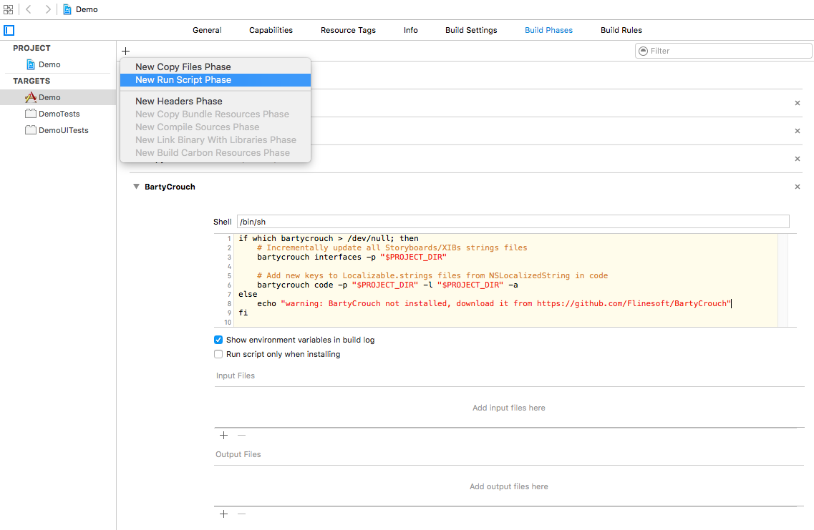
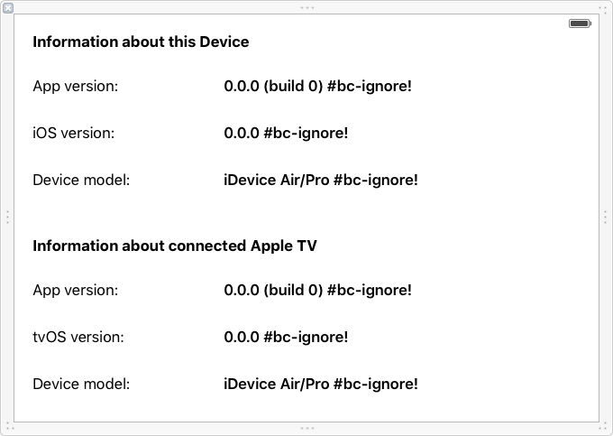

<p align="center">
    
</p>

<p align="center">
    <a href="https://www.bitrise.io/app/d2a5a304b2abcc40">
        
    </a>
    <a href="https://github.com/Flinesoft/BartyCrouch/releases">
        
    </a>
    
    <a href="https://github.com/Flinesoft/BartyCrouch/blob/stable/LICENSE.md">
        
    </a>
</p>

<p align="center">
    <a href="#installation">Installation</a>
  • <a href="#usage">Usage</a>
  • <a href="#build-script">Build Script</a>
  • <a href="#migration-guides">Migration Guides</a>
  • <a href="https://github.com/Flinesoft/BartyCrouch/issues">Issues</a>
  • <a href="#contributing">Contributing</a>
  • <a href="#license">License</a>
</p>


# BartyCrouch

BartyCrouch **incrementally updates** your Strings files from your Code *and* from Interface Builder files. "Incrementally" means that BartyCrouch will by default **keep** both your already **translated values** and even your altered comments. Additionally you can also use BartyCrouch for **machine translating** from one language to 40+ other languages. Using BartyCrouch is as easy as **running a few simple commands** from the command line what can even be **automated using a [build script](#build-script)** within your project.


## Requirements

- Xcode 7.3+ and Swift 2.2+
- Xcode Command Line Tools (see [here](http://stackoverflow.com/a/9329325/3451975) for installation instructions)

## Installation

Install Homebrew first if you don't have it already (more about Homebrew [here](http://brew.sh)):
```shell
$ /usr/bin/ruby -e "$(curl -fsSL https://raw.githubusercontent.com/Homebrew/install/master/install)"
```

Then simply run the commands
```shell
$ brew tap flinesoft/bartycrouch
$ brew install flinesoft/bartycrouch/bartycrouch
```
to install BartyCrouch.

To **update** to the newest version of BartyCrouch when you have an old version already installed run:
```shell
$ brew update
$ brew upgrade flinesoft/bartycrouch/bartycrouch
```

## Usage

Before using BartyCrouch please **make sure you have committed your code**.

### Complete Examples (TL;DR)

With BartyCrouch you can run commands like these:

```shell
# Incrementally updates all Strings files of Storyboards/XIBs in project
$ bartycrouch interfaces -p "/absolute/path/to/project"

# Updates `Localizable.strings` files with new keys searching your code for `NSLocalizedString`
$ bartycrouch code -p "/path/to/code/directory" -l "/directory/containing/all/Localizables" -a

# Machine-translate all empty localization values using English as source language
$ bartycrouch translate -p "/path/to/project" -l en -i "<API_ID>" -s "<API_SECRET>"
```

Also you can make your life a lot easier by using the **build script method** described [below](#build-script).

---

### Sub Commands Overview

The `bartycrouch` main command accepts one of the following sub commands:

- **`interfaces`:** Incrementally updates Strings files of localized Storyboards and XIBs.
- **`code`:** Incrementally updates `Localizable.strings` files from `.h`, `.m` and `.swift` files.
- **`translate`:** Machine-translates values from a source Strings file to all other languages.

Note that *each sub command accepts a different set of options*. Some of them are **required** and some *optional*. You can **combine all options** with each other to create your own expected behavior. If you're not sure which options are available or required you can always look them up in terminal by running a sub command without options like so:

```shell
$ bartycrouch code

Missing required options: ["-p, --path", "-l, --localizables"]

Usage: /usr/local/bin/bartycrouch [options]
  -p, --path:
      Set the base path to recursively search within for code files (.h, .m, .mm, .swift).
  -l, --localizables:
      The path to the folder of your output `Localizable.strings` file to be updated.
  ...
```

---

### Options for all Sub Commands

Some options are common to all sub commands and must (if required) or can always be specified.

#### Path (aka `-p`, `--path`) <small>*required*</small>

For each command BartyCrouch needs to know where it should search for files to do its work. This is done by providing an absolute path to a directory using `-p`.

Example:

```shell
# Finds all Storyboard / XIB files within the specified path as input
$ bartycrouch interfaces -p "/Users/Name/DemoProject/Sources"
```

#### Override (aka `-o`, `--override`) <small>*optional*</small>

BartyCrouch keeps non-empty values by default so nothing gets lost (except for keys which are no longer used). If you want to override all your existing translation values you can force BartyCrouch to do this by specifying the `-o` command.

Example:

```shell
# Clears all values of Storyboards / XIBs Strings files
$ bartycrouch interfaces -p "/path/to/project" -o
```

#### Verbose (aka `-v`, `--verbose`) <small>*optional*</small>

If you want to know exactly which files BartyCrouch found and updated you can specify the `-v` command to see a more verbose output.

Example:

```shell
$ bartycrouch interfaces -p "/path/to/project" -v

Incrementally updated keys of file '/path/to/project/de.lproj/Main.strings'.
Incrementally updated keys of file '/path/to/project/en.lproj/Main.strings'.
Incrementally updated keys of file '/path/to/project/fr.lproj/Main.strings'.
BartyCrouch: Successfully updated strings file(s) of Storyboard or XIB file.
```

---

### Options for `interfaces`

Here's an overview of all options available for the sub command `interfaces`:

- `path` (required), `override` and `verbose` (see [Options for all Sub Commands](#options-for-all-sub-commands) above)
- `default-to-base`

#### Default to Base (aka `-b`, `--default-to-base`) <small>*optional*</small>

To use the Base localization values when adding new keys (instead of empty values) simply add the option `-b`.

Example:

```shell
$ bartycrouch interfaces -p "/path/to/project" -b
```

---

### Options for `code`

Here's an overview of all options available for the sub command `code`:

- `path` (required), `override` and `verbose` (see [Options for all Sub Commands](#options-for-all-sub-commands) above)
- `localizable` (required)
- `default-to-keys`
- `additive`

#### Localizable (aka `-l`, `--localizable`) <small>*required*</small>

Specifies the path to the directory which contains all `Localizable.strings` files within `<locale>.lproj` folders. BartyCrouch will search for all files named `Localizable.strings` recursively within the specified path and incrementally update them. Make sure to specify a path with only your projects `Localizable.strings` files.

Example:

```shell
$ bartycrouch code -p "/path/to/code/files" -l "/Users/Name/DemoProject/Sources/Supporting Files"
```

#### Default to Keys (aka `-k`, `--default-to-keys`) <small>*optional*</small>

To use the keys as localization values when adding new keys (instead of empty values) simply add the option `-k`.

Example:

```shell
$ bartycrouch code -p "/path/to/code/files" -l "/path/to/localizables" -k
```

#### Additive (aka `-a`, `--additive`) <small>*optional*</small>

To prevent BartyCrouch from deleting (seemingly) unused keys you can configure it to **only add new keys** keeping all existing ones by providing the option `-a`. This can be useful for example when you want to generate your `Localizable.strings` using BartyCrouch but use static strings (e.g. with [Laurine](https://github.com/JiriTrecak/Laurine)) once they are added to your Localizables.

Example:

```shell
$ bartycrouch code -p "/path/to/code/files", -l "/path/to/localizables" -a
```

---

### Options for `translate`

Here's an overview of all options available for the sub command `translate`:

- `path` (required), `override` and `verbose` (see [Options for all Sub Commands](#options-for-all-sub-commands) above)
- `id` (required)
- `secret` (required)
- `locale` (required)

#### ID and Secret (aka `-i` and `-s`, `--id` and `--secret`) <small>*required*</small>

BartyCrouch acts as a client for the Microsoft Translator API. In order to use that API you need to **register [here](https://datamarket.azure.com/dataset/bing/microsofttranslator)** (the free tier allows for 2 million translations/month). Then you can **add a client [here](https://datamarket.azure.com/developer/applications)** which will provide you the `id` and `secret` credentials required for machine-translation.

Example:

```shell
$ bartycrouch translate -p "/path/to/project" -l en -i "<YOUR_API_ID>" -s "<YOUR_API_SECRET>"
```

#### Locale (aka `-l`, `--locale`) <small>*required*</small>

This specifies the source language to use as the input for machine-translation. BartyCrouch can only translate keys which have a value in their source language.

Example:

```shell
# Uses Simpliied Chinese as the source language for translating to all other languages
$ bartycrouch translate -p "/path/to/project" -l "zh-Hans" -i "<API_ID>" -s "<API_SECRET>"
```

---

### Build Script

You may want to **update your Strings files on each build automatically** what you can easily do by adding a run script to your target in Xcode. In order to do this select your target, choose the `Build Phases` tab and click the + button on the top left corner of that pane. Select `New Run Script Phase` and copy the following into the text box below the `Shell: /bin/sh` of your new run script phase:

```shell
if which bartycrouch > /dev/null; then
    # Incrementally update all Storyboards/XIBs strings files
    bartycrouch interfaces -p "$PROJECT_DIR"

    # Add new keys to Localizable.strings files from NSLocalizedString in code
    bartycrouch code -p "$PROJECT_DIR" -l "$PROJECT_DIR" -a
else
    echo "warning: BartyCrouch not installed, download it from https://github.com/Flinesoft/BartyCrouch"
fi
```



*Note: Please make sure you commit your code using source control regularly when using the build script method.*

If you want to use the **machine translation functionality** in addition then simply use the following build script instead:

```shell
if which bartycrouch > /dev/null; then
    # Incrementally update all Storyboards/XIBs strings files
    bartycrouch interfaces -p "$PROJECT_DIR"

    # Add new keys to Localizable.strings files from NSLocalizedString in code
    bartycrouch code -p "$PROJECT_DIR" -l "$PROJECT_DIR" -a

    # Translate all empty values using the Microsoft Translator API
    bartycrouch translate -p "$PROJECT_DIR" -l en -i "<API_ID>" -s "<API_SECRET>"
else
    echo "warning: BartyCrouch not installed, download it from https://github.com/Flinesoft/BartyCrouch"
fi
```

It is recommended that you update the `-p "$PROJECT_DIR"` appearances in this script to point to the **directory of your own code only**, for example by using `-p "$PROJECT_DIR/Sources"` instead. Also you should alter `-l "$PROJECT_DIR"` to a path more specific (e.g. `-l "$PROJECT_DIR/Sources/Supporting Files"`). This is to make sure BartyCrouch doesn't change any `Localizable.strings` files within frameworks included using the likes of Carthage or CocoaPods.

---

### Exclude specific Views / NSLocalizedStrings from Localization

Sometimes you may want to **ignore some specific views** containing localizable texts e.g. because **their values are gonna be set programmatically**.
For these cases you can simply include `#bartycrouch-ignore!` or the shorthand `#bc-ignore!` into your value within your base localized Storyboard/XIB file.
This will tell BartyCrouch to ignore this specific view when updating your `.strings` files.

Here's an example of how a base localized view in a XIB file with partly ignored strings might look like:



You can also use `#bc-ignore!` in your `NSLocalizedString` macros comment part to ignore them so they are not added to your `Localizable.strings`. This is helpful when you are using a `.stringsdict` file to handle pluralization (see [docs](https://developer.apple.com/library/ios/documentation/MacOSX/Conceptual/BPInternational/StringsdictFileFormat/StringsdictFileFormat.html)).

For example you can do something like this:
```swift
func updateTimeLabel(minutes: Int) {
  String.localizedStringWithFormat(NSLocalizedString("%d minute(s) ago", comment: "pluralized and localized minutes #bc-ignore!"), minutes)
}
```
The `%d minute(s) ago` key will be taken from Localizable.stringsdict file, not from Localizable.strings.

## Migration Guides

This project follows [Semantic Versioning](http://semver.org).

Please follow the appropriate guide below when **upgrading to a new major version** of BartyCrouch (e.g. 1.5 -> 2.0).

### Upgrade from 2.x to 3.x

- Change structure `bartycrouch -s "$BASE_PATH"` to `bartycrouch interfaces -p "$BASE_PATH"`
- Change structure `bartycrouch -t "{ id: <API_ID> }|{ secret: <API_SECRET> }" -s "$BASE_PATH" -l en` to `bartycrouch translate -p "$BASE_PATH" -l en -i "<API_ID>" -s "<API_SECRET>"`
- Use automatic file search with `-p` (was `-s` before) instead of options `-i`, `-o`, `-e` (those were deleted)
- Rename usages of option "force" (`-f`) to be "override" (`-o`)

It is recommended to update your build script to the [currently suggested](#build-script) one if you were using it.

### Upgrade from 1.x to 2.x

- Change command structure `bartycrouch "$BASE_PATH" -a` to `bartycrouch -s "$BASE_PATH"`
- Remove `-c` option if you were using it, BartyCrouch 2.x creates missing keys by default
- Use the new `-t` `-s` `-l` options instead of adding all Strings files manually, e.g.:

Simplify this build script code

```shell
bartycrouch -t $CREDS -i "$EN_PATH/Localizable.strings" -a -c
bartycrouch -t $CREDS -i "$EN_PATH/Main.strings" -a
bartycrouch -t $CREDS -i "$EN_PATH/LaunchScreen.strings" -a
bartycrouch -t $CREDS -i "$EN_PATH/CustomView.strings" -a
```

by replacing it with this:

```shell
bartycrouch -t "$CREDS" -s "$PROJECT_DIR" -l en
```


### Upgrade from 0.x to 1.x

- `--input-storyboard` and `-in` were **renamed** to `--input` and `-i`
- `--output-strings-files` and `-out` were **renamed** to `--output` and `-o`
- Multiple paths passed to `-output` are now **separated by whitespace instead of comma**
  - e.g. `-out "path/one,path/two"` should now be `-o "path/one" "path/two"`
- `--output-all-languages` and `-all` were **renamed** to `--auto` and `-a`


## Contributing

Contributions are welcome. Please just **open an Issue** on GitHub to discuss a point or request a feature there or **send a Pull Request** with your suggestion.

When sending a pull request please also make sure to:
- **write tests for your changes** in order to make sure they don't break in the future
- follow the same syntax and semantic in your **commit messages** (see rationale [here](http://chris.beams.io/posts/git-commit/))

Note that there is a framework target within the project to make testing easier.


## License
This library is released under the [MIT License](http://opensource.org/licenses/MIT). See LICENSE for details.
